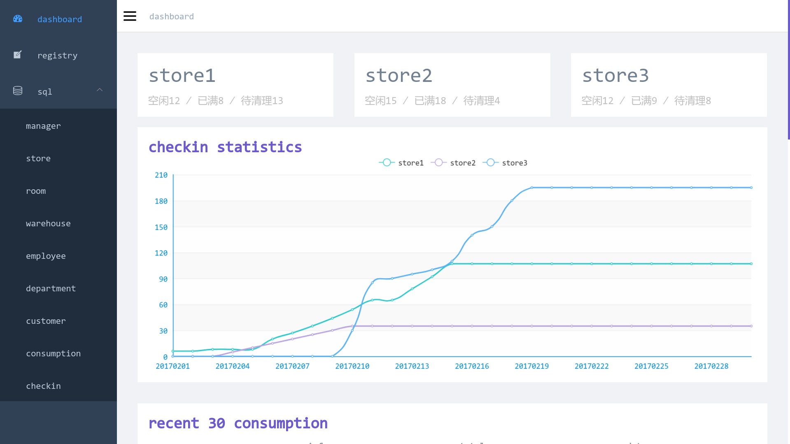
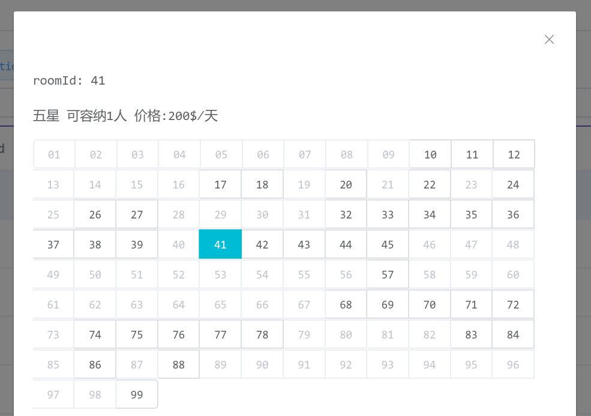
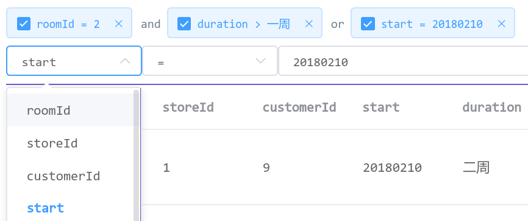

# a just-homework sql demo

this project is based on [electron-vue-admin](https://github.com/PanJiaChen/electron-vue-admin)

### screenshot







### setup

1. copy `sqlexp3.sql` ,paste in sql console

2. change sql connection setting in `src/renderer/api/sql.js`

3. 

   ```
   yarn
   yarn run dev
   ```